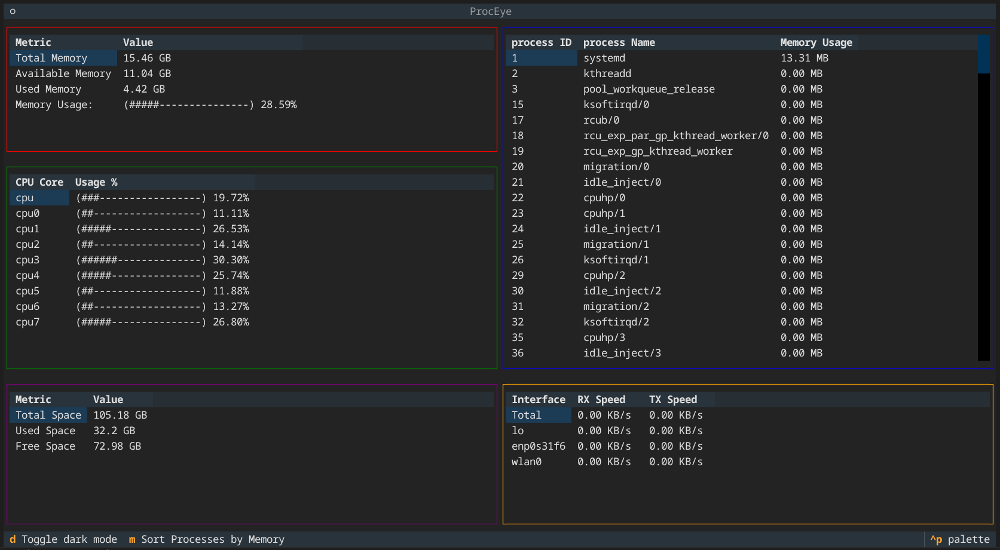

# ProcEye

A lightweight, custom system monitor for Linux built from scratch in Python. 

Unlike standard monitoring tools that rely on high-level libraries like `psutil`, this project interacts directly with the Linux kernel by parsing the `/proc` filesystem. This project is built with the goal of understanding Linux OS internals such as process management, memory usage, and network statistics without relying on external monitoring libraries.



## Project Status:
Core monitoring features are functional, and a Textual-based TUI (Terminal User Interface) has been implemented. The project is currently stable for monitoring CPU, RAM, Network, Disk, and Process lists.

## Features

### 🖥️ TUI Dashboard (`main.py`)
A modern, responsive terminal interface built with `Textual`.
* **Split-View Layout:** Simultaneously view Processes, CPU, Memory, Network, and Disk stats.
* **Live Updates:** Non-blocking, real-time updates for CPU/RAM/Network/Disk (1s interval) and Processes (5s interval).
* **Sorting & Filtering:** Sort processes by Memory usage or PID dynamically.
* **Interactive Tables:** Scrollable process lists and resource usage tables.

### Core Modules (Backend)
* **Process Management:** Scans `/proc` to identify PIDs, resolves executable names, and reads physical memory usage (VmRSS).
* **Memory Analysis:** Parses `/proc/meminfo` to calculate Total, Free, Available, and Used memory in real-time.
* **CPU Usage:** Reads `/proc/stat` to calculate per-core and total CPU usage percentages using differential time snapshots.
* **Network Monitoring:** Parses `/proc/net/dev` to calculate real-time Download (RX) and Upload (TX) speeds.
* **Disk Monitoring:** Parses `/proc/diskstats` to monitor Read/Write speeds for physical drives and uses system calls (`statvfs`) to calculate Total, Used, and Free disk space.

## Requirements
* **OS:** Linux (Tested on Arch-based distributions; compatible with any standard Linux kernel).
* **Python:** 3.8+
* **Dependencies:** * `textual` (For the UI)

## Installation & Usage

1.  **Clone the repository:**
    ```bash
    git clone [https://github.com/ByAaryan/ProcEye.git](https://github.com/ByAaryan/ProcEye.git)
    cd ProcEye
    ```

2.  **Set up the environment (Recommended):**
    ```bash
    python -m venv .venv
    source .venv/bin/activate
    pip install textual
    ```

3.  **Run the Monitor:**
    ```bash
    python main.py
    ```

### Keyboard Shortcuts
| Key | Action |
| :--- | :--- |
| `q` | Quit the application |
| `d` | Toggle Dark/Light Mode |
| `m` | Sort Processes by Memory Usage |